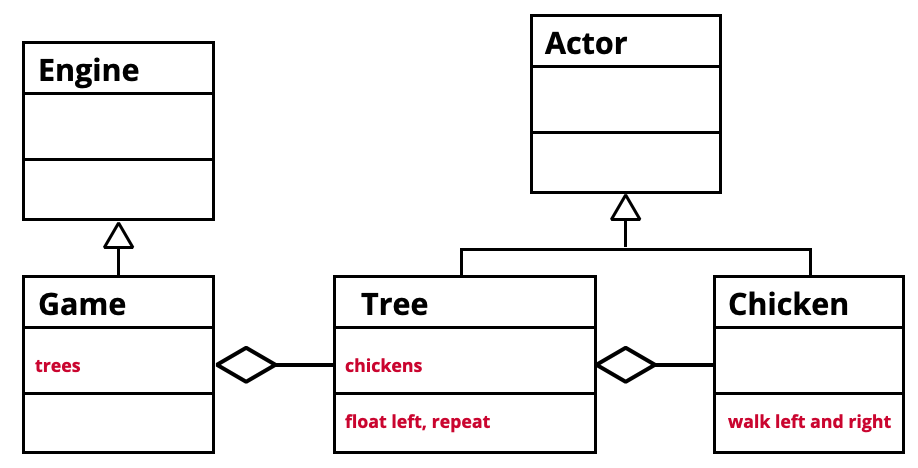

# Les 4 

- Score tonen
- Inheritance
- Composition

<Br><Br><Br>

## Score tonen

In de main game maak je een score label aan. Ook maak je een functie die de score kan updaten. Let op dat het label een property is (`this.label`).
```js
class Game extends Engine {

 startGame() {
   this.label = new Label({
     text: 'Score: 0',
     pos: new Vector(100, 100),
     font: new Font({
        family: 'Arial',
        size: 24,
        unit: FontUnit.Px,
        color:Color.White
     })
    })
    this.add(this.label)
  }
   updateScore(score) {
     this.label.text = `Score: ${score}`
  }
}
```

Hou de score bij in je player. Als er een punt bij komt roep je de updateScore functie van Game.js aan. Let op dat de score een property is (`this.score`).

```js
class Shark extends Actor {
    score
    onInitialize(engine) {
        this.score = 0
    }
    hitSomething(event){
        if(event.other.owner instanceof Fish) {
              this.score++
              this.scene.engine.updateScore(this.score)
        }
    }
}
```


<Br><Br><Br>

## Inheritance

Dit betekent dat een class automatisch de eigenschappen en functions van een andere class kan overnemen. In dit codevoorbeeld zie je dat de class `Robot` de eigenschappen van een `Actor` krijgt. 

```js
import { Actor } from "excalibur"

class Robot extends Actor {

}
```
Omdat de `Robot` nu een Excalibur `Actor` is, kan je de `onInitialize` functie gebruiken. Ook is er nu een `pos` en `vel` beschikbaar:
```js
import { Actor } from "excalibur"

class Robot extends Actor {
    onInitialize(){
        console.log(this.pos)
        console.log(this.vel)
    }
}
```
### Constructor en super()

Als je in jouw class `extends` gebruikt dan moet je het `super()` keyword toevoegen aan je constructor. In Excalibur wordt `super()` gebruikt om de hitbox aan de actor class door te geven.
```js
import { Actor } from "excalibur"

class Robot extends Actor {
    constructor() {
        super({width:100, height:100})
        console.log("ik ben een robot")
    }
}
```


<Br><Br><Br>

## Composition 

Composition houdt in dat je nadenkt over hoe je game is opgebouwd. Zitten al je actors in de main game class, of is het handiger dat een actor zelf ook weer child actors heeft? 

### Code voorbeeld

In dit code voorbeeld plaatsen we een `Car` Actor op een `Road` Actor.

```js
class Road extends Actor {
    onInitialize(){
        let c = new Car()
        this.addChild(c)
    }
}
```
<br><br><br>

# Oefening



In de oefening plaatsen we kippen op een boomstam om te oefenen met composition. 

- Ga naar [excalibur chicken on a raft](https://github.com/HR-CMGT/prg4-chicken-on-a-raft)
- Download het project en volg de opdracht in de readme file.

<br>
