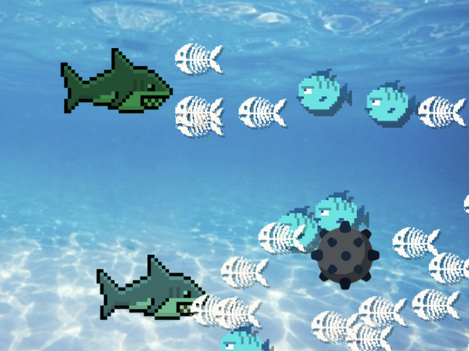

# Les 5



## Communicatie tussen classes

  - Communicatie van actor naar game
  - Waarden doorgeven aan een actor
  - Communicatie tussen actors
  - Actors zoeken
  - Oefening
  - Oefening
  - Oefening

<Br>
<Br>
<Br>


## Communicatie van actor naar game

- Een `Actor` krijgt het `engine` argument in de `update` en `initialize` functies, dit verwijst naar jouw `game` class. 
- Je kan de game vanuit een actor ook altijd aanroepen via `this.scene.engine`.

```javascript
class Mario extends Actor {
    
    onInitialize(engine) {       
        engine.resetScore()
    }

    onPreUpdate(engine) {       
        if(this.pos.y > 1000) {
            engine.gameOver()
        }
    }

    hitCoin(){
        // in je eigen functies krijg je geen "engine", dus dan moet je "this.scene.engine" gebruiken.
        this.scene.engine.addPoint()
    }
}
```
GAME.JS

```javascript
class Game extends Engine {
    
    score = 0

    resetScore() {       
        this.score = 0
    }

    addPoint(){
        this.score++
    }

    gameOver(){
        console.log("game over!")
    }
}
```

<Br>
<Br>
<Br>


## Waarden doorgeven aan een actor

Als je met `new` een instance aanmaakt dan kan je waarden doorgeven, die waarden komen binnen in de `constructor` van jouw class.

Positie meegeven aan BULLET.JS

```js
class Bullet extends Actor {
    constructor(x,y){
        super()
        this.pos = new Vector(x,y)
    }
}
```
alternatief
```js
class Bullet extends Actor {
    constructor(x,y){
        super({x, y})
    }
}
```
GAME.JS

```javascript
class Game extends Engine {
    
    startGame() {       
        let bullet = new Bullet(20,10)
        this.add(bullet)
    }
}
```


<Br>
<Br>
<Br>

## Communicatie tussen actors

### Collision

Bij een collision krijg je een verwijzing naar de class waar je mee botst.

SHARK.JS
```js
export class Shark extends Actor {
    constructor(){
        super({ radius: 50 })
        this.on("collisionstart", (event) => this.onCollide(event))
    }

    onCollide(event) {
       if(event.other.owner instanceof Fish) {
           event.other.owner.hitByShark()
       }
    }
}
```
FISH.JS
```js
export class Fish extends Actor {
    hitByShark() {
       console.log("ARRGHH I was hit by a sharky boy 🦈")
    }
}
```

<Br>
<Br>
<Br>

### De UI class aanroepen

Je kan via `this.scene.engine` ook classes aanroepen die in de game beschikbaar zijn, zoals een `UI` class.

GAME.JS

```javascript
class Game extends Engine {
    
    ui   // ui moet een property zijn als je er van buitenaf bij wil kunnen
    
    startGame() {       
        this.ui = new UI()
        this.add(this.ui)

        let player = new Player()
        this.add(player)
    }
}
```
UI.JS
```javascript
class UI extends Actor {
    score = 0
    showScore(){
        console.log(this.score)
    }
}
```
PLAYER.JS
```javascript
class Player extends Actor {
    hitSomething(event){
        if(event.other.owner instanceof Coin) {
            this.scene.engine.ui.showScore()
        }
    }
}
```

<br><br><br>

## Actors zoeken

De game heeft altijd een array `this.currentScene.actors` waarbinnen je kan zien welke actors nog alive zijn (geen `kill()` aangeroepen). Die array kan je vanuit een actor ook vinden via `this.scene.actors`.

Je kan met `filter` alle actors van een type ophalen. Met `find` krijg je de eerste actor van een type. Je kan met een `for` loop door je actors loopen.

```js
class Game extends Engine {

    startGame(){
        let someShark = new Shark()
        this.add(someShark)
        for(let i = 0; i < 10; i++) {
            let f = new Fish()
            this.add(f)
        }
    }

    findFishes() {
        let fishes = this.currentScene.actors.filter(actor => actor instanceof Fish)
        console.log(`Er zijn nog ${fishes.length} vissen`)
    }

    findShark() {
        let shark = this.currentScene.actors.find(actor => actor instanceof Shark)
        console.log(shark)
    }

    gameOver() {
        for(let actor of this.currentScene.actors) {
           actor.kill()
        }
        this.startGame()
    }
}
```
> *De actors array kan je vanuit een actor vinden via `this.scene.actors`.*

<br><br><br>

# Oefening

- Voeg onderstaande UI class toe aan je project
- Maak een instance van de UI in ***game.js*** : `this.ui = new UI()`
- De ***Shark*** heeft een eigenschap `this.score`
- De Shark krijgt een punt als je een Fish raakt
- De Shark roept de functie `showScore()` aan van de `ui` om de punten te tonen.

```js
import {Vector, Actor, Label, Font, FontUnit, Color } from "excalibur"

class UI extends Actor {

    label

    constructor() {
        super()
        this.label = new Label({
            text: 'Score: 0',
            pos: new Vector(100, 100),
            font: new Font({
                family: 'Arial',
                size: 24,
                unit: FontUnit.Px,
                color:Color.White
            })
        })
        this.add(this.label)
    }
    showScore(score) {
        this.label.text = `Score: ${score}`
    }
}
```

<br><br><br>

# Oefening

We gaan een local mutiplayer game maken met twee sharks. Bij het aanmaken van de shark geef je door of het player one of player two is.

```js
class Game extends Engine {
    startGame(){
        let pOne = new Shark("player-one")
        let pTwo = new Shark("player-two")

        this.add(pOne)
        this.add(pTwo)
    }
}
```

- In de code van de shark moet je de controls afhankelijk maken van welke speler het is:
Player One: WASD, Player Two : Cursor Keys
- Toon van beide sharks de score in de UI
- Geef de Shark een random tint zodat ze er niet precies hetzelfde uit zien

```js
let sprite = Resources.Shark.toSprite()
this.graphics.use(sprite)
sprite.tint = Color.fromRGB(Math.random() * 255, Math.random() * 255, Math.random() * 255)
```


<br><br><br>

# Oefening


- Voeg een *Mine* class toe aan je project, met dit [plaatje van een mine](../images/mine.png).
- Er is één mine in het aquarium die langzaam naar links beweegt
- In de Shark voeg je een collision check toe die kijkt of je een `Mine` hebt geraakt.
- Zo ja, dan zoekt de shark via `this.scene.actors` naar alle Fishes in de scene:

```js
let fishes = this.scene.actors.filter(actor => actor instanceof Fish)
```

- Loop door de gevonden fishes array met een `for` loop, roep per fish de `wasEatenByShark` functie aan. 
- Hoeveel punten krijgt de shark?

#### Expert

- Je kan dit verbeteren door alleen de fishes te verwijderen die in beeld zijn! 

```js
if (!fish.isOffScreen) {...}
```


