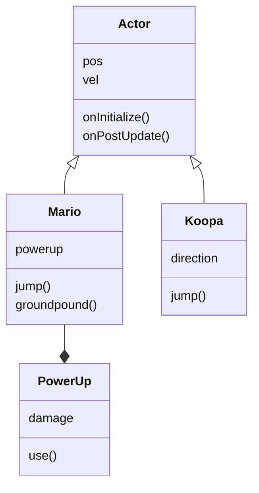

# Les 6 

- Herhaling klassendiagram
- Expert level: Encapsulation
- Oefening
- Spawning
- Oefening
- Oefening
- Timers
- Expert level: Enemy Behaviour

<br><br><br>

## Herhaling Klassendiagram

Een klassendiagram is een visuele weergave van je project. Je kan OOP classes tekenen als blokjes, waarin je de methods en properties aangeeft. Tussen de classes teken je pijltjes die aangeven wat de relatie tussen de classes is:

- Een class *heeft* een andere class (composition) *Mario heeft een PowerUp*.
- Een class *is* een andere class (inheritance) *Mario is een Actor*.

<br>



Zie hier nog een [voorbeeld](../snippets/classdiagram.md)

<br><br><br>

# Oefening

Teken het klassendiagram voor jouw inleveropdracht.

- Begin met het omschrijven van je game in een korte tekst.
- Bedenk vervolgens welke onderdelen daarvan een eigen class kunnen krijgen.
- Dit zijn meestal objecten waar je "eigenschappen en gedrag" aan kan geven.
- Teken lijntjes tussen de classes voor composition en inheritance.

### Templates
- Endless runner
- Space Shooter
- Fishing Game
- Zombie Survivor
- Platform game

<br><br><br>

## Expert level: Encapsulation

Je classes hebben properties en methods. Deze kan je afschermen voor andere classes door ze `private` te maken. In javascript doe je dat door de properties en methods achter een hekje `#` te zetten. Deze zijn nu niet meer bruikbaar voor code buiten de `Car` class.

```js
class Car {
    #brand;
    #mileage;

    constructor(brand) {
        this.#brand = brand;
        this.#mileage = 0; 
    }

    getDetails() {
        return `${this.#brand}, - ${this.#mileage} miles`;
    }

    drive() {
        this.#increaseMileage(10)
    }

    #increaseMileage(distance) {
        this.#mileage += distance;
    }
}
```


<br><br><br>

## Spawning

Dit betekent dat je tijdens de gameplay nieuwe instances aanmaakt met het `new` keyword. Bijvoorbeeld, als een Actor schiet, dan spawned er een bullet in de game. De positie van die bullet is meestal de positie van de actor.

```js
export class Player extends Actor {
    shoot() {
        let b = new Bullet()
        b.pos = new Vector(this.pos.x, this.pos.y)
        this.scene.add(b)
    }
}
export class Bullet extends Actor {
    constructor() {
        super({ width: 10, height: 10 }) 
        this.vel = new Vector(100,0)
    }
}
```
> *Als de Player een child van een andere actor is, dan kan je ook via `this.globalPos.x, this.globalPos.y` de exacte positie in de wereld opvragen.*

Vergeet niet om gespawnde bullets ook weer uit de game te verwijderen

```js
export class Bullet extends Actor {
    onInitialize(engine) {
        this.events.on("exitviewport", () => this.kill());
    }
}
```
### Explosions

Als een bullet een vijand raakt kan je een explosie spawnen op die positie. De explosie verwijdert zichzelf na een fade-out.

```js
export class Explosion extends Actor {

     constructor(x, y) {
        super({x,y,width:100, height:100})
     }
     onPostUpdate(engine) {
        this.scale = this.scale.add(new Vector(0.06, 0.06))
        this.graphics.opacity -= 0.05
        if(this.graphics.opacity < 0.01) {
            this.kill()
        }
    }
}
```


<br><br><br>

# Oefening


Begin met de shark + fishes opdracht uit les 1,2,3

### Deel 1
- Als een Fish door de Shark wordt geraakt dan wordt de Fish gereset (dit hebben we in les 3 gemaakt)
- Voeg [dit vissengraat plaatje](../images/bones.png) toe aan je Resources
- Maak een class voor de Vissengraat

### Deel 2
- Spawn een vissengraat *in de game* zodra de Fish geraakt is door de Shark, *op de plek van de Fish*
- De code hiervoor zet je in Fish.js
- De vissengraat zakt langzaam naar de bodem.
- Als de vissengraat de bodem bereikt verwijder je de vissengraat.

### Tips:
- Gebruik de pos van de Fish om de Visgraat op de juiste plek te zetten. 
- Je kan de visgraat omlaag laten zakken met velocity
- Gebruik "onPostUpdate" of het "exitviewport" event om te weten wanneer je de visgraat weg moet halen.


<br><br><br>

# Oefening


Ga verder met de shark + fishes opdracht

### Deel 1
- Zorg dat je een Bubble class hebt met [dit plaatje van een luchtbel](../images/bubble.png)
- Verwijder eventuele Bubbles uit je game class, als die er nog stonden van vorige les.
- Verwijder de collision code uit de haai (comment)

### Deel 2
- Geef die collision code aan de Bubble (als de bubble een fish raakt, wordt de Fish gereset)
- Geef de bubble een velocity van 100,0 (beweegt snel naar rechts)

### Deel 3
- Geef de Haai een Shoot() functie.
- Voeg code toe in de Shark die checkt of de spatiebalk "wasPressed" (dus niet "isHeld")
- Zo ja, dan roep je de "shoot()" functie aan van de Haai
- In deze functie spawn je een bubble op de plek van de Haai.

### Tips
- Spawn de bubble in de Scene met this.scene.add
- Check of het spawnen van de "Bones" nog steeds werkt (in Fish.js)
- Gebruik de pos van de Shark om de Bubble op de juiste plek te zetten. Misschien moet de bubble iets naar rechts?


<br><Br><br>

## Timer

Je kan in Excalibur geen `setInterval` of `setTimeout` gebruiken omdat daarbij geen rekening met de gameloop wordt gehouden.

De simpelste oplossing hiervoor is om zelf een frame counter bij te houden. Elke keer dat er een aantal frames is verstreken laat je iets gebeuren.

```js
export class Fish extends Actor {

    frameCounter

    constructor() {
        super({width:100,height:100})
        this.frameCounter = 0
    }

    onPostUpdate(engine) {
        this.frameCounter++
        if(this.frameCounter > 120) {
            console.log("2 seconden verstreken")
            this.frameCounter = 0
        }
    }
}
```

Je kan in excalibur een `delay` toevoegen voordat code wordt uitgevoerd:

```js
class Fish extends Actor {

    onInitialize(engine) {
        engine.clock.schedule(() => {
                console.log("this message shows after 2 seconds")
        }, 2000)
    }
}

```

<br><br><br>

## Expert level: enemy behaviour

Bekijk de slides van deze les voor tips over het geven van gedrag aan je vijanden.
